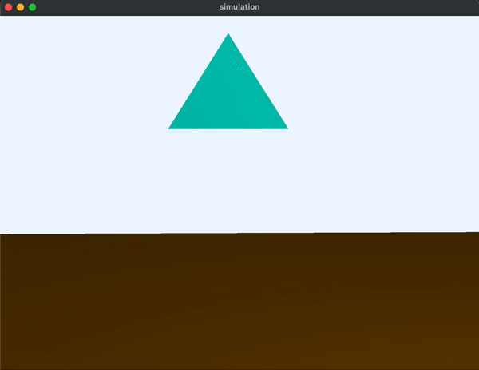
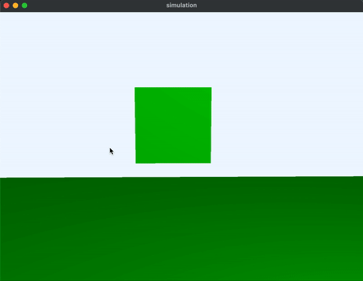
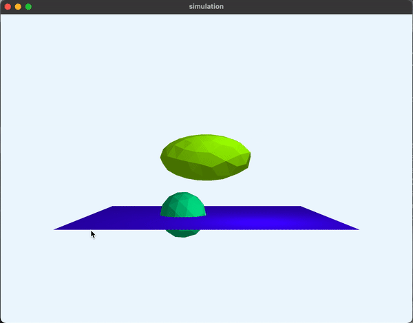

# Assignment 3: Finite Element Simulation (FEM)

**Released:** 3/8/23

**Due:** 3/22/23 @ 11:59pm EST

In this assignment, you’ll animate deformable solid objects using the Finite Element Method (FEM). The name “Finite Element Method” comes from the fact that this approach divides a continuous chunk of material into a mesh made up of a finite number of discrete elements (in this case, you’ll use tetrahedra). FEM allows for the simulation of physically-based materials in a principled way (as opposed to ad-hoc methods such as spring-and-mass simulations). You will implement the core features needed for a basic deformable object simulation (e.g. force computation, time integration, simple collision resolution) plus one or more extra features. To show off what your code can do, you’ll submit one or more videos demonstrating your simulator in action.

## Relevant Reading

- The lecture slides!
- [Baraff and Witkin’s course notes](https://www.cs.cmu.edu/~baraff/sigcourse/) on physically-based modeling are a good reference for the basics of dynamics and time integration.
- [O’Brien and Hodgins](http://graphics.berkeley.edu/papers/Obrien-GMA-1999-08/Obrien-GMA-1999-08.pdf) provide a good introduction to FEM fundamentals for graphics (Sections 1 - 3).
- [Adam Bargteil’s Finite Element Notes](https://cal.cs.umbc.edu/Courses/CS6967-F08/FE-notes.pdf) are a nice supplement.
- [This handout](https://web.stanford.edu/class/cs205b/lectures/lecture7.pdf) on computing strain and stress may also be informative.

## Requirements

This assignment is out of **100 points**.

Your simulator must implement at least the following features:

* Extract the surface mesh from your tetrahedral mesh **(10 points)**
* Compute and apply force due to gravity **(5 points)**
* Compute and apply internal elastic forces **(30 points)**
  * Compute Green’s strain for each element
  * Compute the stress for each element
  * Compute per-node forces
  * You can assume a lumped-mass model for your mesh (i.e. constant density within an element, mass of element distributed evenly to its four vertices).
* Compute and apply internal viscous damping forces **(10 points)**
* Resolve collisions **(10 points)**
  * You must implement collision between the mesh and a ground plane, as well as at least one other type of obstacle (e.g. spheres).
  * The simple ‘penalty force’ method described in Section 3.3 of [O’Brien and Hodgins](http://graphics.berkeley.edu/papers/Obrien-GMA-1999-08/Obrien-GMA-1999-08.pdf) can work, but it's not terribly stable.
  * A better option is to do the following for every tet vertex that inter-penetrates a collidier: (1) Project the vertex out of the collider, (2) Decompose the vertex's velocity into a a *normal component* (i.e. parallel to surface normal of the collider at the point of intersection and a *tangential component* (perpendicular to the collider normal), (3) Set the normal component of the velocity to zero, (4) Scale the tangential component of the velocity by some friction constant between 0 and 1. 
* Integrate your simulation forward in time using the explicit [midpoint method](https://www.pixar.com/assets/pbm2001/pdf/notesb.pdf) **(10 points)** (regular Euler integration recommended to start with)
* Video **(10 points)**
  * You must submit at least one video demonstrating your simulator in action. The video(s) must demonstrate all of the features you have implemented (including any extra features). Particularly creative and/or nicely-rendered animations may receive extra credit. Think about interesting scenarios you could set up. Please use a standard format and codec for your video files (e.g. .mp4 with the H264 codec).
    * There are a few different ways you might go about making such videos:
    * Screen capture an OpenGL rendering of your simulation, e.g. using the interactive viewer code that we provide below (see “Resources”).
    * Export frame-by-frame meshes from your simulator and use your path tracer from Assignment 1 to render them.
    * Use some other modeling/animation/rendering software to render exported meshes (e.g. Maya, Blender).
  * To turn a set of frame images into a video, you can use [FFMPEG](https://hamelot.io/visualization/using-ffmpeg-to-convert-a-set-of-images-into-a-video/).
* README **(5 points)**
  * Your README should explain your logic for 
    * extracting the surface mesh
    * computing and applying internal forces
    * collision resolution
    * your explicit integration method
    * and any extra features you choose to implement
  * Explanations should be 3 sentences each maximum
  * You should also embed your videos into the README file

Successfully implementing all of the requirements results in a total of **90/100 points**.
To score **100/100** (or more!), you’ll need to implement some extra features.

### Extra Features
Each of the following features that you implement will earn you extra points. The features are ordered roughly by difficulty of implementation.

* Share a cool tet mesh on Slack **(2 points)**
* Make the visualizer pretty **(5 points)**
  * Miss programming shaders? Modify shader.frag to add some fancy effects. Skyboxes, shadows, FBO hacks, and more are all welcome.
* A higher-order explicit integrator **(5 points)**
  * This will allow you to take larger simulation timesteps.
  * Runge-Kutte 4
  * [Verlet integration](https://resources.saylor.org/wwwresources/archived/site/wp-content/uploads/2011/06/MA221-6.1.pdf)
* Adaptive time stepping **(5 points)**
  * Take the largest time step you can take while remaining within some error threshold.
  * [Baraff and Witkin’s](https://www.cs.cmu.edu/~baraff/sigcourse/notesb.pdf) notes are helpful here.
* Parallelize your code **(5 points)**
  * Many simulator operations are ‘embarrassingly parallel’ (force computations, integrator steps, etc.)
  * Even something as simple as [OpenMP’s parallel for loop](http://supercomputingblog.com/openmp/tutorial-parallel-for-loops-with-openmp/) can buy you significant speedups, if applied in the right places.
* Interactivity **(10 points)**
  * Allow the user to poke, push, drag, etc. a deformable mesh.
* Self collisions **(15 points)**
  * Or, collisions between two deformable meshes.
  * The [O’Brien and Hodgins paper](http://graphics.berkeley.edu/papers/Obrien-GMA-1999-08/Obrien-GMA-1999-08.pdf) has some suggestions for how to do this.
* Something else!
  * This list is not meant to be exhaustive--if you’ve got another advanced feature in mind, go for it! (though you may want to ask a TA or the instructor first if you’re concerned about whether the idea is feasible) 

### Advanced Extra Features
These extra features are significantly more challenging to implement, and they involve reading other papers to implement. Some of these are probably big enough in scope to be closer to final project ideas, to be honest. I’ve listed them here for completeness and to potentially get some people interested in some of these ideas :)

* Corotated linear elasticity **(20 points)**
  * Take a look at [this paper](https://matthias-research.github.io/pages/publications/GI2004.pdf).
  * Factors out the rotational part of a tetrahedron’s deformation when computing element stress. This allows for fast, stable simulations.
* Invertible elements **(20 points)**
  * Take a look at [this paper](http://physbam.stanford.edu/~fedkiw/papers/stanford2004-04.pdf).
  * Allows for tetrahedra to invert, return to their original shape, and remain stable.
* Plasticity **(20 points)**
  * Make some part of the deformation that a mesh undergoes permanent, so that it does not fully return to its original rest shape.
  * There are different ways to implement this depending on your elasticity model:
    * [O’Brien et al.](http://graphics.berkeley.edu/papers/Obrien-GMA-2002-08/Obrien-GMA-2002-08.pdf) - Basic Green’s strain formulation
    * [Müller and Gross](https://matthias-research.github.io/pages/publications/GI2004.pdf) - Formulation for corotated linear elasticity
    * [Irving et al.](http://physbam.stanford.edu/~fedkiw/papers/stanford2004-04.pdf) - Formulation for invertible elements
* Fracture **(20 points)**
  * Split the mesh when stresses become sufficiently large.
  * Try the method in the [Müller and Gross paper](https://matthias-research.github.io/pages/publications/GI2004.pdf). The method in the [O’Brien and Hodgins paper](http://graphics.berkeley.edu/papers/Obrien-GMA-1999-08/Obrien-GMA-1999-08.pdf), while more physically accurate, is much more complicated to implement.
* Semi-implicit integration **(25 points)**
  * Take very large time steps by ‘backwards’ simulation: find the step that, when run backwards from where you want the simulation to end up, takes the simulation to its current state.
  * Once again, [Baraff and Witkin](https://www.cs.cmu.edu/~baraff/sigcourse/) have a good introduction.
  * You’ll need to compute the derivative of node forces w.r.t. node positions. [Adam Bargteil’s notes](https://cal.cs.umbc.edu/Courses/CS6967-F08/FE-notes.pdf) have some derivations for this.
  * You’ll also need to set up and solve a sparse linear system. [Eigen](http://eigen.tuxfamily.org/index.php?title=Main_Page) provides some good C++ libraries for this.
* Learning deformable dynamics **(25 points)**
  * Take a look at [this paper](https://arxiv.org/pdf/1803.09109.pdf).
  * The DeepWarp model learns to adjust a simplified simulation (using linear elasticity) with a displacement fix.

**Any extra features you implement must be mentioned in your README and demonstrated in your video (you can submit multiple videos to show off different features, if that’s easier).**

### Resources

Feel free to use this stencil code to get started.

This includes a simple interactive 3D viewer for visualizing (and dynamically updating) tetrahedral meshes, as well as several example tetrahedral mesh files you can load.

These files are in the .mesh format, a line-by-line file format that resembles the .obj file format. Lines come in one of two types:

* `v x y z` -- a vertex at location (x, y, z).
* `t i1 i2 i3 i4` -- a tetrahedron whose vertices are located at indices i1, i2, i3, and i4 in the list of vertices.

If you want to create new tetrahedral meshes, you can do so using one of the following software packages:

* [fTetWild](https://github.com/wildmeshing/fTetWild)
* [Netgen](https://sourceforge.net/projects/netgen-mesher/)
* [Tetgen](http://wias-berlin.de/software/index.jsp?id=TetGen&lang=1)
* [Quartet](https://github.com/crawforddoran/quartet)

These output their own various file formats (as there is, alas, less standardization in tet mesh file formats than for tri meshes), so you’d need to convert those to the .mesh format.

## Starter Code
The starter code in this repo provides a simple 3D viewer for tetrahedral mesh simulations. **After cloning the repo locally, you'll need to run `git submodule update --init --recursive` to update the Eigen submodule.**

As given, the starter code will load up and visualize a single tetrahedron. Your job is to modify the code to load arbitrary meshes (e.g. the ones in `/example-meshes`), extract their surface meshes for visualization, and to compute simulation time step updates to the vertex positions of the mesh.

You'll want to look at `src/simulation.cpp` to get started, as that's the only file you need to change (although you'll probably make several of your own new files, too).
You also might want to look at `src/view.cpp`, if you're interested in adding new interactivity/controls to the program.

Speaking of controls: the controls offered by the starter code are:
 * Move Camera: WASD
 * Look around: Click and hold mouse and drag
 * Toggle orbit mode: C (changes the camera from a first-person view to an orbiting camera a la what the Maya editor does)
 * Toggle between displaying the surface mesh and a wireframe of the full tet mesh: T

When the program first loads, you should see a ground plane and a single tet floating in space, against a gray background.
If the tet does not display: check the console output. Most likely the .mesh file failed to load because the file couldn't be found. You'll need to set the working directory in Qt Creator to be the root directory of this repository. To do that, select "Projects" on the left-hand sidebar in Qt Creator, select "Run" under the "Build & Run options", and enter the path to the repo root in the "Working directory" field.

### Implementation & Debugging Tips

- Start by simulating a single tetrahedron and verifying that everything works in that case.
- If your mesh has no forces applied, the deformation gradient for each element should be the identity matrix.
- A sanity check: try initializing the position of one or more vertices to be different than the rest configuration; verify that the mesh moves back to its rest state when you run the simulation.
- See the lecture slides for tips on what to do if your simulation explodes.
- The lecture slides contain a few examples of material parameters. If you want more, you can check out the tables given [here](https://www.efunda.com/materials/common_matl/Common_Matl.cfm?MatlPhase=Solid&MatlProp=Mechanical) and [here](http://web.mit.edu/16.20/homepage/3_Constitutive/Constitutive_files/module_3_no_solutions.pdf). Be aware that most of these materials are very stiff and will likely be difficult to simulate in a stable manner. [This Wikipedia page](https://en.wikipedia.org/wiki/Lam%C3%A9_parameters) lists formulas for converting between different types of material parameters. What you want are “Lamé's first parameter” (that’s λ)  and “Shear modulus” (that’s μ). 
- Here’s a set of parameters that have worked for students in previous years (with midpoint and rk4 integrators for the sphere and ellipsoid and a timestep of 0.001 in `view.cpp`):
  - const Vector3f \_gravity = Vector3f(0.f, -.1f, 0.f);
  - const float \_lambda = 1e3f; //incompressibility for the whole material
  - const float \_mu = 1e3f; //rigidity for the whole material
  - const float \_phi = 1e1f; //coefficients of viscosity
  - const float \_psi = 1e1f;
  - const float \_rho = 1200.f; //density
- Use `const` and `assert` wherever possible.
- Check for uninitialized values.
- Use Qt Creator's debugger.
- **For numeric values that your simulation keeps track of (positions, velocities, forces, etc.), use** `double` **and** `Eigen::Vector3d` **instead of** `float` **and** `Eigen::Vector3f`**. The additional precision can have a big impact on your simulation's stability.**
- **REMINDER: Your code will run much faster if you compile in Release mode ;)**

### Submission Instructions

Submit your branch of the Github classroom repository to the “Simulation” assignment.

## Example Video

- For the following example these parameters are used (Note: The video is compressed to gif and might not have the same frame rate with the real simulation):
    - Eigen::Vector3d \_g = Eigen::Vector3d(0.0, -1.0, 0.0); // gravity
    - double \_kFloor = 4e4; //penalty for node collision
    - double \_lambda = 4e3; //incompressibility for the whole material
    - double \_mu = 4e3; //rigidity for the whole material
    - double \_phi = 100; //coefficients of viscosity
    - double \_psi = 100; 
    - double \_density = 1200.0; //density
    - timestep = 0.0003f; 

Single tetrahedron falling on the floor.

Cube falling on the floor.

Ellipsoid falling on the floor with fixed sphere.

